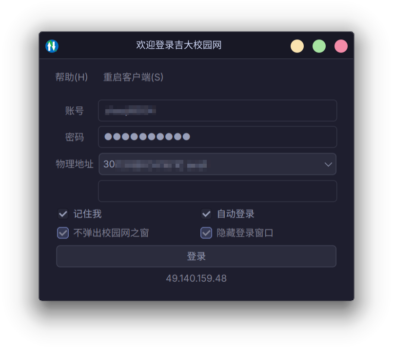
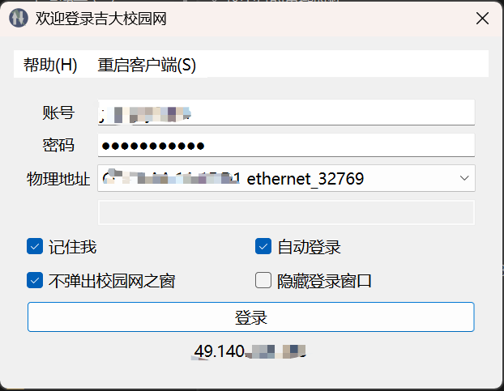
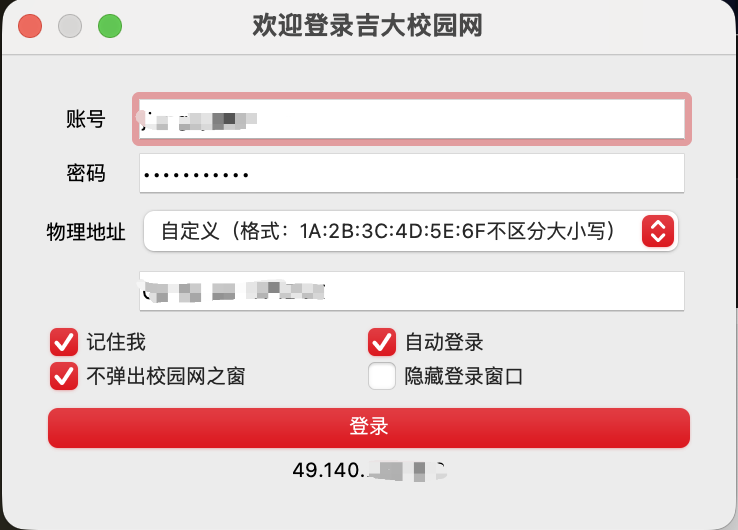

# drcom-jlu-qt

吉林大学校园网第三方跨平台客户端（DrCOM 协议 / Qt 实现）。

- **跨平台支持**：Linux (Arch Linux, Ubuntu 等)、Windows (MinGW / MSVC)、macOS (Apple Silicon)。
- **GitHub Actions 持续集成**：可在仓库 Actions 页面手动触发 `build workflow`，自动生成各平台最新编译产物。
- **Arch Linux 原生兼容**：完美支持 Qt6 与 Wayland 原生协议渲染，内存占用低至 ~26MB。

[最新 Releases 下载](https://github.com/ZHAO20060708/drcom-jlu-qt/releases)

---

## 功能特性与对比

| 功能特性 | 官方客户端 | 本版客户端 | 说明 |
| :--- | :---: | :---: | :--- |
| **开机自动登录 / 记住密码** | √ | √ | 支持配置记住密码后完全静默后台登录 |
| **密码加密存储** | √ | √ | Windows 使用 DPAPI，其他平台使用混淆加密 |
| **秒级极速启动** | 慢 | **极快** | 纯 C++/Qt 编写，无多余外壳与繁重开销 |
| **单实例保护** | × | **√** | 重复打开自动唤醒已有实例，杜绝多实例冲突 |
| **系统托盘常驻** | 偶发双图标 | **√** | 支持最小化至托盘与原生 Wayland/X11 托盘图标 |
| **静默自启动参数** | × | **√** | 支持 `--minimized` 启动直接静默驻留后台 |
| **可选不弹校园网之窗** | × | **√** | 登录成功后可选择不自动打开 notice 欢迎页 |
| **心跳防抖与端口复用** | 差 | **√** | 内置 3 次心跳超时重试，端口预设复用，杜绝端口占用 |
| **规范日志输出** | × | **√** | 写入系统标准数据目录，不污染工作区与系统日志 |
| **免 Root / 免管理员** | × | **√** | 绑定高位非特权 UDP 端口（61440），普通用户权限即可运行 |
| **高分屏 (HiDPI) 适配** | 模糊 | **√** | Qt6 默认全缩放矢量适配 |

---

## 快速上手

### Arch Linux / 基于 Arch 的发行版

Arch Linux 用户可以直接安装 Qt6 开发包并在本地一键编译出极度轻量的原生二进制（~200KB）：

```bash
# 1. 安装编译依赖
sudo pacman -S --needed base-devel qt6-base

# 2. 编译项目
git clone https://github.com/ZHAO20060708/drcom-jlu-qt.git
cd drcom-jlu-qt
qmake6 DrCOM_JLU_Qt.pro
make -j$(nproc)

# 3. 安装与运行
install -Dm755 DrCOM_JLU_Qt ~/.local/bin/drcom-jlu-qt
~/.local/bin/drcom-jlu-qt --minimized
```

### 开机自启动配置 (Linux / XDG)

在 `~/.config/autostart/drcom-jlu-qt.desktop` 创建如下文件即可随桌面环境（KDE / GNOME 等）自动拉起：

```ini
[Desktop Entry]
Type=Application
Name=DrCOM JLU
Comment=吉林大学校园网第三方 Qt 客户端
Exec=/home/eric/.local/bin/drcom-jlu-qt --minimized
Icon=drcom-jlu-qt
Terminal=false
Categories=Network;
StartupNotify=false
X-GNOME-Autostart-enabled=true
```

---

## 运行截图

### Arch Linux (KDE Plasma / Wayland)



### Windows 11



### macOS



### Ubuntu


---

## 注意事项

- **MAC 地址选择**：连接吉大校园 Wi-Fi（如 `JLU.PC`）时，MAC 地址可以任意选择已存在的网卡或保持默认；仅在插有线网线时要求 MAC 地址与校园网认证登记的网卡一致。
- **自动重连**：掉线后若勾选了“记住我”和“自动登录”，客户端会自动尝试重连；重试期间保持静默，不会反复弹窗打扰。
- **macOS 安全提示**：在 macOS 上初次打开若提示“未认证的开发者”或“已损坏”，请前往“系统设置 - 隐私与安全性”点击“仍要打开”，或执行 `xattr -cr /Applications/DrCOM_JLU_Qt.app`。

---

## 鸣谢

- 图标设计：[lyj3516](https://github.com/lyj3516)
- 吉大 DrCOM 协议分析：[jlu-drcom-client](https://github.com/drcoms/jlu-drcom-client)
- 单实例实现：[SingleApplication](https://github.com/itay-grudev/SingleApplication)
- 认证发包算法参考：[dogcom](https://github.com/mchome/dogcom)
- 原作者项目：[code4lala/drcom-jlu-qt](https://github.com/code4lala/drcom-jlu-qt)

---

## 许可证

本项目基于 [GNU Affero General Public License v3.0](LICENSE) 开源。
